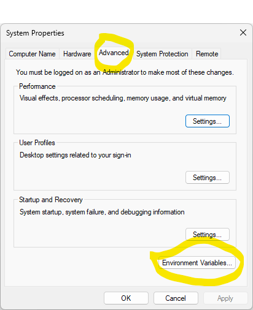
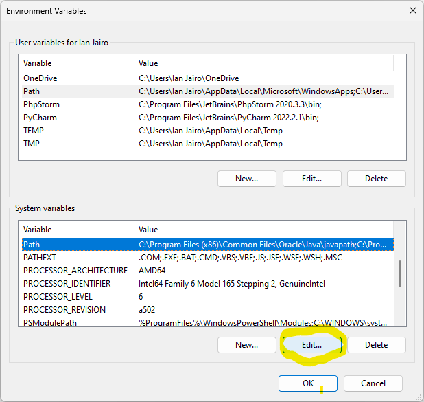
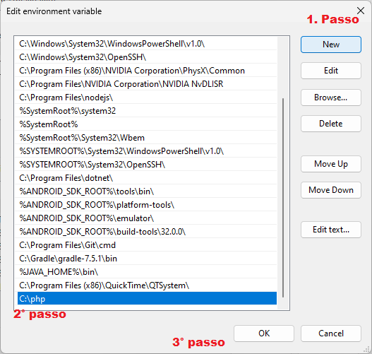
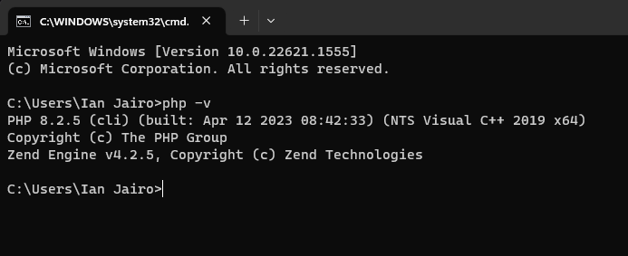

# Instalação Completa 

Escolha o seu sistema operacional e siga com a instalação.

## Windows
1. Faça o download do PHP no site oficial: https://windows.php.net/download/
1. Escolha a versão mais recente do PHP que seja compatível com o seu sistema operacional (x64 Thread Safe, neste caso) e clique no link de download correspondente.

1. Extraia o arquivo baixado em uma pasta de sua escolha. Você pode usar o WinRAR ou outro software de descompressão de arquivos.

1. Renomeie a pasta extraída para "php" e mova-a para o diretório raiz do seu disco rígido ``(exemplo: C:\php)``.

1. Abra o "Editor de variáveis de ambiente" do Windows, clicando com o botão direito do mouse em "Este computador" e selecionando "Propriedades". Na janela que abrir, selecione "Configurações avançadas do sistema".

1. Na janela "Propriedades do sistema", selecione a aba "Avançado" e clique no botão "Variáveis de ambiente".

1. Na seção "Variáveis do sistema", localize a variável "Path" e clique em "Editar".

1. Clique em "Novo" e adicione o caminho para a pasta PHP ``(exemplo: C:\php)``.

1. Clique em "OK" para fechar todas as janelas de configuração.

Agora você pode testar a instalação do PHP digitando `php -v` no Prompt de Comando do Windows. Se tudo estiver correto, você verá a versão do PHP instalada na sua máquina.



## Linux (UBUNTU)
1. Abra um terminal no Ubuntu (você pode pressionar as teclas ``Ctrl + Alt + T`` para abrir o Terminal).
1. Atualize a lista de pacotes do sistema executando o seguinte comando:

``` ubuntu 
sudo apt-get update
```
3. Instale o PHP e alguns módulos. Isso irá instalar o PHP e o módulo necessário para se comunicar com o servidor MySQL, além do Apache (servidor web) e o módulo do PHP para o Apache.

Digite o seguinte comando:

```
sudo apt-get install php libapache2-mod-php php-mysql
```

4. Verifique se o PHP foi instalado corretamente digitando o seguinte comando:

``` ubuntu 
php -v
```

Isso deve exibir a versão do PHP instalada em sua máquina.


